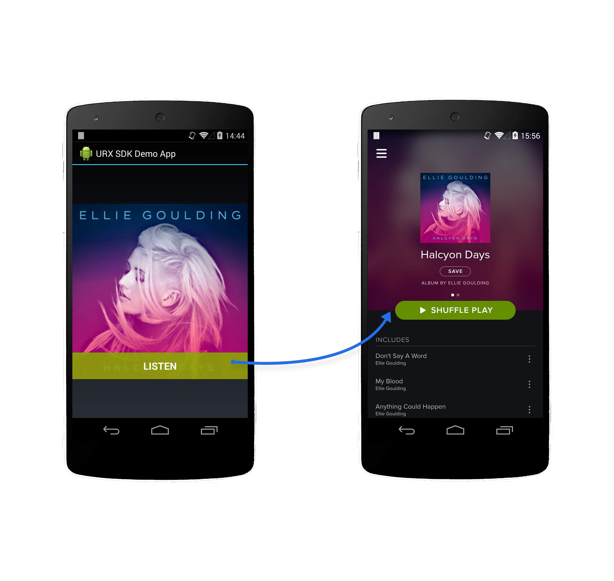

URX Android SDK Example App
===========================

An example Android app demonstrating the full integration of the [URX App Search SDK](https://github.com/URXtech/urx-sdk-android). 

This app makes a search query (`"ellie goulding" AND lights AND action:ListenAction`) and displays the image of the first result, along with a button that deeplinks the user to the destination:




Before Building
----------------

Insert your API key in the MainActivity.java.

Building
--------
In order to build the project:
```bash
./gradlew clean build
```

To install the built APK to a device, connect your device to a free USB port on your computer, then run:
```bash
./gradlew installDebug
```

If you get warnings about not being able to connect to the device, try restarting the ADB server:
```bash
adb kill-server
adb start-server
```

And then verify that your computer recognizes your device by running:
```bash
adb devices
```

Contributing
------------
TODO

License
-------
Copyright 2014 URX

Licensed under the Apache License, Version 2.0 (the "License");
you may not use this file except in compliance with the License.
You may obtain a copy of the License at

   http://www.apache.org/licenses/LICENSE-2.0

Unless required by applicable law or agreed to in writing, software
distributed under the License is distributed on an "AS IS" BASIS,
WITHOUT WARRANTIES OR CONDITIONS OF ANY KIND, either express or implied.
See the License for the specific language governing permissions and
limitations under the License.

